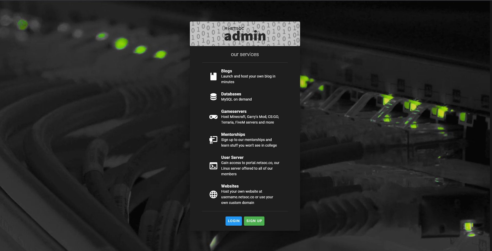
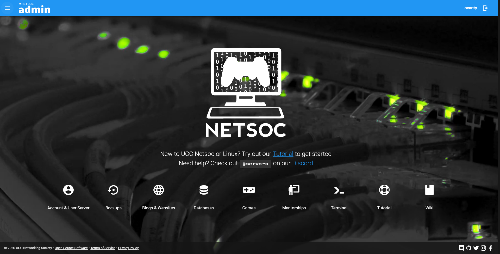
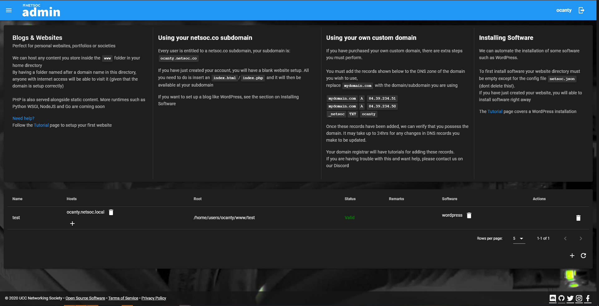
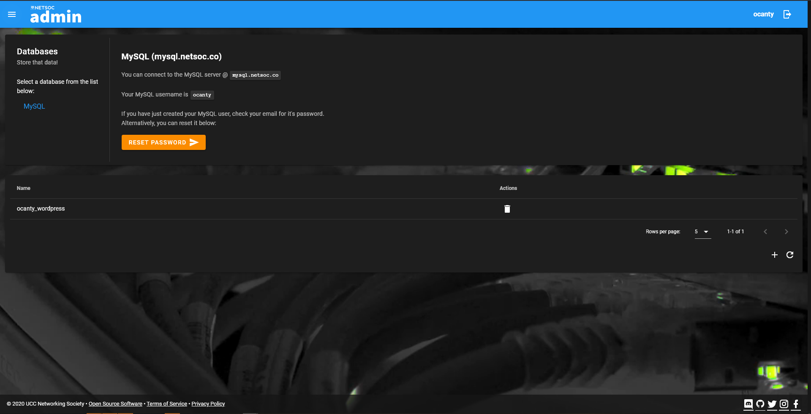

admin is the REST API and control panel powering UCC Netsoc's services available to members of the society.

It consists of an OpenAPI compliant REST API written in FastAPI, a frontend in Vue(x) using Vuetify and (coming soon) a command line application

# Features:
* Account sign-in and sign-up system (backed by Keycloak OIDC & FreeIPA)
* Backups (can serve backups from a cron job or FS snapshots)
* Database creation and management (MySQL)
* GDPR compliance (can download user data)
* Mentorship sign ups
* Terminal access to our Linux server (usng Wetty)
* Websites (powered with isolation by Nginx Unit) with software installation

# Screenshots

# Development environment:

1. You will need Docker and `pip` installed

1. Pull the repo
1. Run `./start-dev.sh`

    1. This will setup the Python virtual env for you and install `docker-compose`
    1. We run a FreeIPA server and client container as part of the development environment
        * FreeIPA is very peculiar about filesystem permissions and ownership (which git does not do a good job of preserving).
        * Therefore, we bundle FreeIPA's data as a `.tar.gz` file, `./start-dev.sh` will untar it into the correct directories for you
        * If you make modifications to FreeIPA settings/user home directories that you believe should be committed back into the repo run `./compress-freeipa.sh` and `git add freeipa-data.tar.gz` in the project root
    1. You will then enter the project venv and you are free to begin development
1. You can run `docker-compose up` in the project root to boot the services. This will setup the following containers
  
    * admin.netsoc.local
      * Vue frontend
      * http://admin.netsoc.local:8080
    * api.netsoc.local
      * FastAPI API 
      * http://api.netsoc.local
      * http://api.netsoc.local/openapi.json
      * http://api.netsoc.local/docs
      * http://api.netsoc.local/metrics
    * ipa.netsoc.local
      * FreeIPA server
      * http://ipa.netsoc.local/ipa/ui/
    * ipaclient.netsoc.local
      * A FreeIPA client enrolled in the FreeIPA server
      * If you want to "pretend" to be one of the user accounts signed up for Netsoc Admin:
        * Run `docker-compose exec ipaclient.netsoc.local bash`
        * Then run `su <user>` where user is one of the users mentioned further below in this document
    * keycloak.netsoc.local
      * Keycloak server (configured to serve OAuth2/OpenID Connect for the frontend by federating to FreeIPA's LDAP)
      * http://keycloak.netsoc.local:8080/auth/
    * mysql.netsoc.local
      * MySQL server
    * unit.netsoc.local
      * The Nginx Unit Server that runs user websites and applications
      * http://unit.netsoc.local:8080
    * unitproxy.netsoc.local
      * This is an Nginx instance that reverse proxies the Nginx Unit API (unix socket) and puts basic auth in front of it to secure it
    
    * proxy.netsoc.local
      * A SOCKS5 proxy so we can get a network inside the dev env
      * To make use of this, you need to setup your browser:
        * Firefox: check proxy settings
        * Chrome: close all chrome instances
            * Windows: `"C:\Program Files (x86)\Google\Chrome\Application\chrome.exe" --proxy-server="socks5://localhost:1080"`
            * Linux: similar to above, just use your chrome path
    * whoami.netsoc.local
      * Use this to test if your proxy is working
      * http://ipa.netsoc.local
1. Setup the proxy with your browser and you should now be able to access all of the services
1. There are two users available to use in IPA/Keycloak/Netsoc Admin:
    
    1.
        * username: `ocanty`
        * password: `IHateBeans`
        * email: `ocanty@example.com`
        * groups: `netsoc_account, netsoc_sysadmin`
    2.
        * username: `eric`
        * password: `ILoveBeans`
        * email: `eric@example.com`
        * groups: `netsoc_account`
1. The API Web UI is available at http://api.netsoc.local/docs
  
    * To authorize, use a username and password from above, use `netsocadmin` as the Client ID and select all scopes then hit Login.
      * You can now use any route that requirements authorization
      * The `netsoc_sysadmin` account should be able to modify the resources of any `netsoc_account`

### Troubleshooting and common issues

* Keycloak down and  `User with username 'netsoc_keycloak' already added to '/opt/jboss/keycloak/standalone/configuration/keycloak-add-user.json'` in logs
  * You killed keycloak while it was booting up and loading
  * Run `docker-compose rm keycloak.netsoc.local` and `docker-compose up keycloak.netsoc.local`

* Console spamming IPA client can't verify IPA server/API crashing repeatedly
  * This is normal (for the first few seconds on first boot)
  * If it persists, it means that the ipa server is probably down
  * Try `docker-compose ps ipa.netsoc.local`
    * If FreeIPA up, try:
      * `docker-compose exec ipa.netsoc.local bash` and run `systemctl status`
      * Check service logs using `journalctl`
    * If FreeIPA down, check logs in
      * `./backing-services/freeipa/data/var/log/ipa-*.log`
      * `ipa-server-configure-first.log` is normally the first log that gets written
  * In both cases it might be helpful to run `./freeipa-delete-data.sh` and `./freeipa-decompress-data.sh` to get a clean FreeIPA installation

## Service passwords

* FreeIPA
    * `admin:netsoc_freeipa`
* Keycloak
    * `netsoc_keycloak:netsoc_keycloak`
* MySQL
    * `root:netsoc_mysql`
* Nginx Unit Proxy
    * `netsoc_unit:netsoc_unit`

## Testing functionality

* Backups are served from `<home dir>/.snaps`, you will need to fill this directory with files/folders to test backup downloading
  * Do this by execing into ipaclient and creating the files as the user

* Websites can be tested by visiting `http://unit.netsoc.local:8080` with a browser extension that sets the Host header to the header of the website you want to be served to you

# Configuration format

See `config.sample.yaml`

