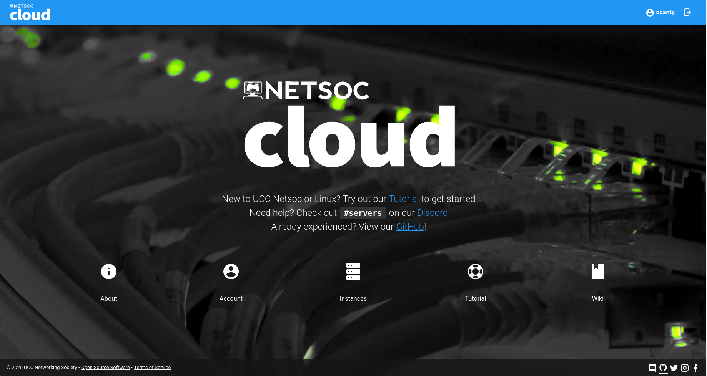
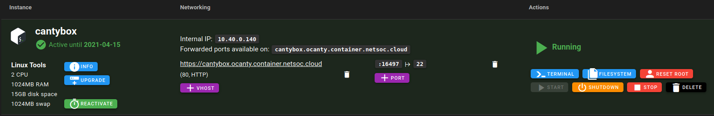
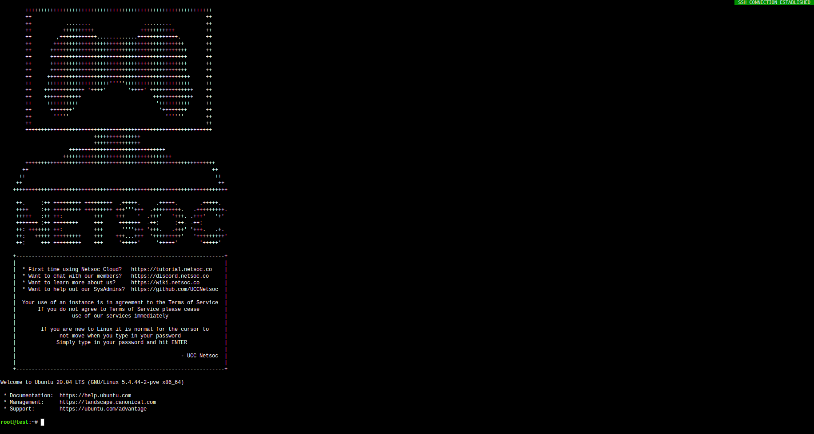
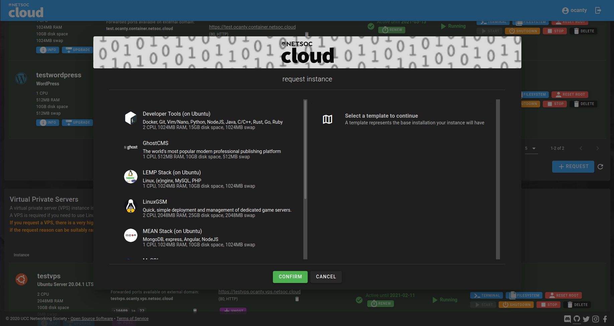

Netsoc Cloud is the REST API and control panel powering UCC Netsoc's services available to members of the society.
It provides Container and VPS hosting built atop of Proxmox with routing powered by Traefik

It consists of an OpenAPI compliant REST API written in FastAPI, a frontend in Vue(x) using Vuetify and (coming soon) a command line application

# Configuration format

See `config.sample.yaml`

# Screenshots

